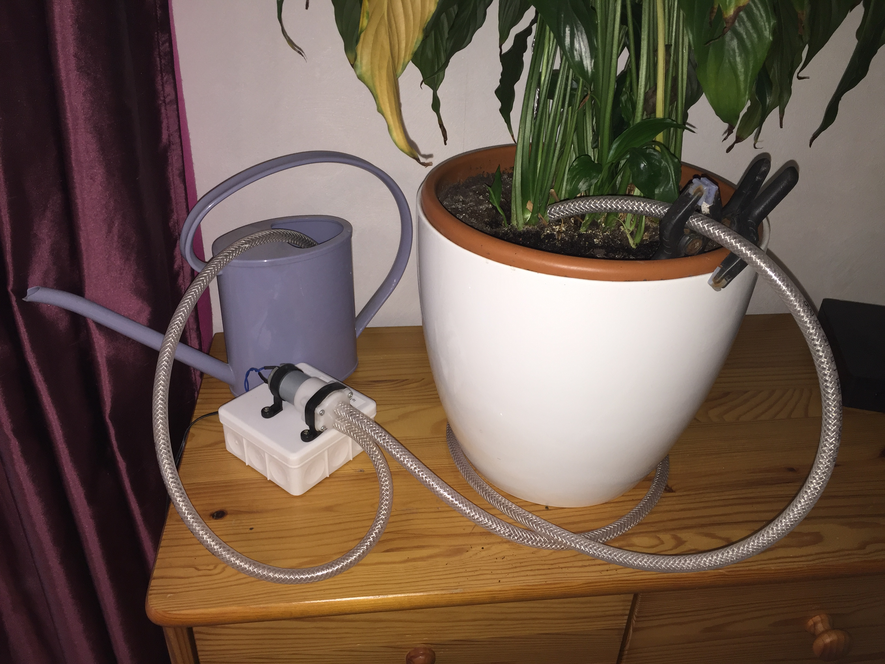
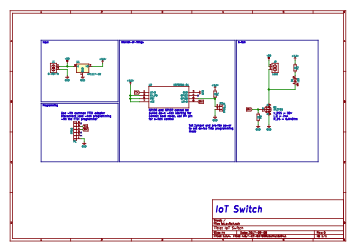
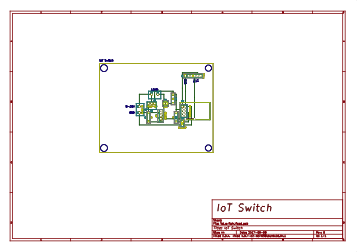

# IoT Household Plant Watering System

This project is about building an internet connected switch and use it together with a water pump to automatically irrigate household plants.

It is meant to be part of a larger home automation network, where nodes are controlled from a central hub via a [Node-RED](https://nodered.org/) server, it can also be used as stand-alone.

The [build process](https://hackaday.io/project/27108-iot-household-plant-watering-system) is documented on Hackaday.io.

## Hardware

The [complete bill-of-materials](https://hackaday.io/project/27108-iot-household-plant-watering-system) is documented on Hackaday.io. The electronic files, including schematic and layout, are under `/hardware`.

The diaphragm pump is off of eBay and can function between 6-12V.

## Software

The software is developed with [Arduino IDE](https://www.arduino.cc/en/Main/Software) and the [ESP8266 core](https://github.com/esp8266/Arduino). The MQTT libraries are courtesy of [knolleary](https://github.com/knolleary/pubsubclient).

Before uploading the code the network credentials, MQTT broker address and port and the topic names need to be set. Once configured and uploaded the software can be [updated over WiFi](http://esp8266.github.io/Arduino/versions/2.0.0/doc/ota_updates/ota_updates.html) (Over-The-Air updating) from Arduino IDE.

## Usage

The system is controlled via [MQTT messages](https://en.wikipedia.org/wiki/MQTT), the suggested approach is to use [Node-RED](https://nodered.org/) server with an MQTT broker to configure the control flow.

The device subscribes to the following MQTT messages:

* **water**: sets the state of the pump, 1 activates and 0 deactivates it
* **timeout**: sets the maximum time the pump is allowed to function in milliseconds, if the pump is not stopped before the timeout runs out it will stop automatically
* **dutycycle**: sets the PWM duty cycle from 0 to 100% for the motor, allows to control the speed of the pump

The settings for the timeout and duty cycle are stored in the EEPROM and persist over reboots.

## License

The software is licensed under [GNU General Public License](https://en.wikipedia.org/wiki/GNU_General_Public_License).
